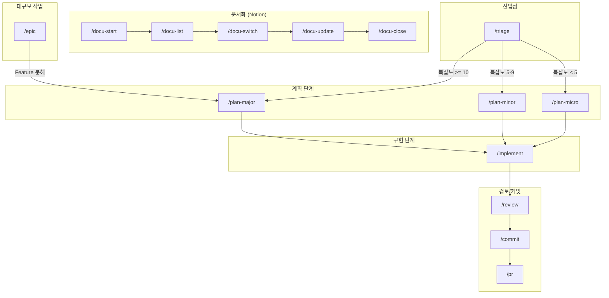

# 명령어 레퍼런스

이 문서는 Claude Workflow의 모든 슬래시 명령어와 그 관계를 설명합니다.

## 워크플로우 다이어그램



---

## 명령어 카테고리

### 1. 워크플로우 진입점

| 명령어 | 설명 | 산출물 |
|--------|------|--------|
| `/triage` | 복잡도 분석 및 워크플로우 자동 선택 | 워크플로우 추천 |
| `/start` | 프로젝트 초기화 | `.claude/`, `.specify/` 구조 |

### 2. 계획 명령어 (문서만 생성)

| 명령어 | 복잡도 | 산출물 | Hook |
|--------|--------|--------|------|
| `/plan-major` | >= 10 | spec.md, plan.md, tasks.md | PostHook (문서 검증) |
| `/plan-minor` | 5-9 | fix-analysis.md | PostHook (필수 섹션 검증) |
| `/plan-micro` | < 5 | 없음 (바로 구현) | - |

### 3. 구현 명령어

| 명령어 | 설명 | 기반 문서 |
|--------|------|----------|
| `/implement` | 스마트 구현 (자동 컨텍스트 선택) | spec.md, plan.md, tasks.md 또는 fix-analysis.md |

### 4. 검토/커밋 명령어

| 명령어 | 설명 | Hook |
|--------|------|------|
| `/review` | 코드 리뷰 (품질, 보안, 성능) | PreHook (옵션 검증) |
| `/commit` | 커밋 메시지 생성 및 커밋 | PreHook (staged 검증) |
| `/pr` | Pull Request 생성 | PreHook (push 상태 검증) |

### 5. 문서화 명령어 (Notion 연동)

| 명령어 | 설명 |
|--------|------|
| `/docu-start` | Notion 기능 명세서 기반 작업 시작 |
| `/docu-list` | 진행 중인 작업 목록 표시 |
| `/docu-switch` | 다른 작업으로 컨텍스트 전환 |
| `/docu-update` | 현재 작업 상태 업데이트 |
| `/docu-close` | 작업 완료 처리 및 Notion 동기화 |

### 6. 대규모 작업 명령어

| 명령어 | 설명 | 산출물 |
|--------|------|--------|
| `/epic` | 복잡도 16+ 대규모 작업 관리 | epic.md, progress.md, roadmap.md |

---

## 명령어별 상세

### `/triage`

**용도**: 작업 복잡도 분석 및 적절한 워크플로우 추천

**워크플로우**:
1. 작업 설명 입력
2. 복잡도 점수 계산 (0-20)
3. 워크플로우 추천:
   - 복잡도 >= 10 → `/plan-major`
   - 복잡도 5-9 → `/plan-minor`
   - 복잡도 < 5 → `/plan-micro`
   - 복잡도 >= 16 → `/epic` 고려

**사용 예시**:
```bash
/triage "사용자 인증 시스템 추가"
# → 복잡도: 12/20
# → 추천: /plan-major
```

---

### `/plan-major`

**용도**: Major 워크플로우 계획 수립 (문서만 생성, 구현 안함)

**산출물**:
- `.specify/features/NNN-name/spec.md` - 요구사항 명세서
- `.specify/features/NNN-name/plan.md` - 구현 계획
- `.specify/features/NNN-name/tasks.md` - 작업 목록

**PostHook 검증**:
- 문서 존재 확인
- 플레이스홀더 검출 (미완성 방지)
- 필수 섹션 확인

**사용 예시**:
```bash
/plan-major
# → spec.md, plan.md, tasks.md 생성
# → PostHook 검증 통과 시 완료
```

---

### `/plan-minor`

**용도**: Minor 워크플로우 계획 수립 (분석 문서만 생성)

**산출물**:
- `.specify/fixes/NNN-name/fix-analysis.md` - 문제 분석 및 솔루션

**PostHook 검증**:
- fix-analysis.md 존재 확인
- 필수 섹션 확인 (Issue, Root Cause, Solution, Tasks)

**사용 예시**:
```bash
/plan-minor
# → fix-analysis.md 생성
# → PostHook 검증 통과 시 완료
```

---

### `/implement`

**용도**: 계획 문서 기반 스마트 구현

**자동 컨텍스트 선택**:
1. 미완료 tasks.md 탐지
2. 미완료 fix-analysis.md 탐지
3. 없으면 사용자에게 선택 요청

**사용 예시**:
```bash
/implement
# → 자동으로 미완료 작업 탐지
# → tasks.md 기반 구현 진행
```

---

### `/epic`

**용도**: 대규모 프로젝트 관리 (복잡도 16+)

**산출물**:
- `.specify/epics/NNN-name/epic.md` - Epic 정의
- `.specify/epics/NNN-name/progress.md` - 진행 상황
- `.specify/epics/NNN-name/roadmap.md` - 로드맵
- `.specify/epics/NNN-name/features/` - 하위 Feature 디렉토리

**특징**:
- Epic 하위 Feature는 새 브랜치를 생성하지 않음
- Epic 브랜치 내에서 모든 Feature 작업

---

## Deprecated 명령어

다음 명령어는 v4.0에서 제거 예정입니다.

| Deprecated | 대체 명령어 |
|------------|-------------|
| `/major` | `/triage` → `/plan-major` → `/implement` |
| `/minor` | `/triage` → `/plan-minor` → `/implement` |
| `/docu` | `/docu-start`, `/docu-list`, `/docu-switch`, `/docu-update`, `/docu-close` |

**마이그레이션 가이드**: `.claude/docs/MIGRATION.md`

---

## Hook 시스템

### PreHook (실행 전 검증)

| Hook 파일 | 대상 명령어 | 검증 내용 |
|-----------|------------|----------|
| `commit-pre.sh` | `/commit` | staged 변경사항, 민감정보 |
| `pr-pre.sh` | `/pr` | push 상태, gh auth |
| `review-pre.sh` | `/review` | 옵션 유효성 |
| `start-pre.sh` | `/start` | 중복 초기화 방지 |

### PostHook (실행 후 검증)

| Hook 파일 | 대상 명령어 | 검증 내용 |
|-----------|------------|----------|
| `plan-major-post.sh` | `/plan-major` | 문서 완성도 |
| `plan-minor-post.sh` | `/plan-minor` | 필수 섹션 |

### Exit Code

| Code | 의미 |
|------|------|
| 0 | 성공 (계속 진행) |
| 1 | 경고 (계속 진행, 메시지 표시) |
| 2 | 실패 (명령어 차단) |

---

## 관련 문서

- **마이그레이션 가이드**: `.claude/docs/MIGRATION.md`
- **CLAUDE.md 규칙**: `.claude/CLAUDE.md`
- **Epic 007 문서**: `.specify/epics/007-command-pattern-extension/epic.md`

---

**문서 버전**: 1.0.0
**최종 수정**: 2025-11-26
