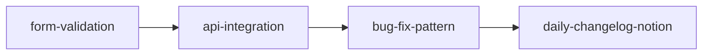

# 🎯 Claude Workflows Skills 상세 가이드

## 목차
1. [Skills 아키텍처](#skills-아키텍처)
2. [전체 Skills 목록](#전체-skills-목록)
3. [상세 사용 가이드](#상세-사용-가이드)
4. [통합 패턴](#통합-패턴)
5. [성능 최적화](#성능-최적화)
6. [트러블슈팅](#트러블슈팅)

---

## Skills 아키텍처

### 기본 구조
```
skill-name/
├── SKILL.md           # 메인 스킬 정의
├── patterns/          # 재사용 가능한 패턴들
│   ├── type-error.md
│   ├── null-check.md
│   └── async.md
├── checklist/         # 검증 체크리스트
│   └── post-fix.md
└── examples/          # 사용 예시
    └── usage.md
```

### SKILL.md 구조
```yaml
---
name: skill-name              # 스킬 식별자
description: 간단한 설명      # 자동 활성화 판단 기준
allowed-tools: [...]          # 허용된 도구 목록
---
# 스킬 본문 (지시사항)
```

### 동작 원리
1. **자동 발견**: 시작 시 모든 skills 메타데이터 로드 (30-50 토큰)
2. **지연 로딩**: 필요 시점에만 전체 내용 로드
3. **자동 활성화**: Claude가 작업 맥락에서 자동 판단
4. **도구 제한**: allowed-tools로 권한 제어

---

## 전체 Skills 목록

### 신규 Skills (재사용성 강화)

### 🔄 reusability-enforcer (신규)
**목적**: 코드 작성 전 기존 재사용 가능 모듈을 자동 검색하고 제안

**주요 기능**:
- 기존 패턴 자동 검색
- 유사 코드 발견 및 재사용 제안
- 패턴 일관성 강제
- 중복 방지

**활성화 조건**:
- `/triage` 실행 후 Major/Minor 워크플로우 진입 시
- 새 컴포넌트/기능 구현 전
- "재사용 가능한 모듈이 있는지" 질문 시

**사용 예시**:
```bash
🔍 재사용 가능 모듈 검색 중...
✅ Button 컴포넌트 - 100% 재사용 가능
⚠️ UserForm과 70% 유사 - BaseForm 추출 고려
```

---

### 📊 reusability-metrics (신규)
**목적**: 코드 재사용성 메트릭을 측정하고 추적

**주요 기능**:
- 재사용률 계산 (목표: 60% 이상)
- 중복 코드 비율 측정 (목표: 5% 이하)
- 공유 컴포넌트 사용률 추적
- 개선 기회 제안

**메트릭 리포트**:
```markdown
📊 재사용성 메트릭
- 재사용률: 65% ✅
- 중복률: 4.2% ✅
- Shared 사용: 12개/feature ✅
```

---

### 기존 Skills

### 1. 🐛 bug-fix-pattern
**목적**: 일반적인 버그 패턴 자동 감지 및 수정

**주요 패턴**:
- TypeScript 타입 에러
- Null/Undefined 참조 에러
- React Hook 의존성 경고
- 비동기 상태 관리 문제
- React Query stale data

**파일 구조**:
```
bug-fix-pattern/
├── SKILL.md
├── patterns/
│   ├── type-error.md      # 타입 에러 해결 패턴
│   ├── null-check.md       # Null 안전 처리
│   └── async.md           # 비동기 패턴
└── checklist/
    └── post-fix.md        # 수정 후 체크리스트
```

**활성화 조건**:
- "타입 에러 고쳐줘"
- "Cannot read property of undefined"
- useEffect 경고 발생

**수정 예시**:
```typescript
// ❌ Before
const value = data.user.name;

// ✅ After (자동 수정)
const value = data.user?.name ?? '';
```

---

### 2. 📅 daily-changelog-notion
**목적**: Git 변경사항을 Notion 페이지로 자동 문서화

**주요 기능**:
- Git log 분석 및 그룹화
- 커밋 메시지 한국어 번역
- Notion 페이지 자동 생성
- 통계 및 요약 생성

**Notion 템플릿**:
```markdown
# 2025년 1월 6일 변경 이력

## 📊 통계
- 총 커밋: 15개
- 변경 파일: 23개
- 추가: +456 라인
- 삭제: -123 라인

## 🔄 주요 변경사항
### ✨ 새 기능
- 운송 신청 폼 개선
- 차량 선택 UI 업데이트

### 🐛 버그 수정
- 타입 에러 수정 (VehicleInfo.tsx)
- null 참조 에러 해결

## 📝 상세 커밋 로그
[표 형식으로 커밋 정보]
```

**활성화 조건**:
- "오늘 변경사항 정리"
- "이번 주 changelog 작성"
- 정기 보고서 생성

---

### 3. 🏗️ fsd-component-creation
**목적**: FSD 아키텍처 규칙을 준수하는 컴포넌트 자동 생성

**레이어별 템플릿**:

**Entity 컴포넌트**:
```typescript
// entities/order/ui/OrderCard.tsx
interface OrderCardProps {
  order: Order;  // 순수 도메인 데이터만
}

export const OrderCard = ({ order }: OrderCardProps) => {
  // 순수 함수, state 없음, side-effect 없음
  return <div>{order.id}</div>;
};
```

**Feature 컴포넌트**:
```typescript
// features/order-create/ui/CreateOrderForm.tsx
interface CreateOrderFormProps {
  initialData?: OrderFormData;  // 도메인 데이터만
}

export const CreateOrderForm = ({ initialData }: CreateOrderFormProps) => {
  // 훅 기반 비즈니스 로직
  const { mutate } = useCreateOrder();

  return <form>...</form>;
};
```

**파일 생성 구조**:
```
feature-name/
├── api/
│   └── createOrder.ts
├── model/
│   ├── types.ts
│   └── useCreateOrder.ts
├── ui/
│   └── CreateOrderForm.tsx
└── index.ts
```

**활성화 조건**:
- "새 컴포넌트 만들어줘"
- "FSD 구조로 생성"
- Major 워크플로우 구현 단계

---

### 4. 🔌 api-integration
**목적**: httpClient 기반 API 통합 패턴 자동화

**생성 요소**:
1. **타입 정의**:
```typescript
// shared/api/types/order.ts
export interface CreateOrderRequest {
  vehicleType: VehicleType;
  scheduledAt: string;
  addresses: Address[];
}

export interface CreateOrderResponse {
  id: string;
  status: OrderStatus;
  createdAt: string;
}
```

2. **API 함수**:
```typescript
// shared/api/order.ts
export const orderApi = {
  create: (data: CreateOrderRequest) =>
    httpClient.post<CreateOrderResponse>('/api/orders', data),

  get: (id: string) =>
    httpClient.get<Order>(`/api/orders/${id}`),

  update: (id: string, data: Partial<Order>) =>
    httpClient.patch<Order>(`/api/orders/${id}`, data),
};
```

3. **React Query 훅**:
```typescript
// features/order/model/useCreateOrder.ts
export const useCreateOrder = () => {
  const queryClient = useQueryClient();

  return useMutation({
    mutationFn: orderApi.create,
    onSuccess: (data) => {
      queryClient.invalidateQueries({ queryKey: ['orders'] });
      toast.success('주문이 생성되었습니다');
    },
    onError: (error) => {
      toast.error(error.message);
    },
  });
};
```

4. **MSW 목업**:
```typescript
// shared/api/mocks/handlers/order.ts
export const orderHandlers = [
  http.post('/api/orders', async ({ request }) => {
    const body = await request.json();
    return HttpResponse.json({
      id: faker.string.uuid(),
      ...body,
      status: 'pending',
      createdAt: new Date().toISOString(),
    });
  }),
];
```

**활성화 조건**:
- API 엔드포인트 추가
- "API 통합해줘"
- httpClient 설정 필요

---

### 5. 📝 form-validation
**목적**: React Hook Form + Zod 기반 폼 검증 패턴

**생성 요소**:

1. **Zod 스키마**:
```typescript
// features/order/model/schema.ts
export const orderFormSchema = z.object({
  vehicleType: z.enum(['truck_1t', 'truck_2.5t', 'truck_5t']),

  scheduledAt: z.string()
    .min(1, '배송 일시를 선택해주세요')
    .refine(
      (date) => new Date(date) > new Date(),
      '과거 시간은 선택할 수 없습니다'
    ),

  addresses: z.array(
    z.object({
      address: z.string().min(1, '주소를 입력해주세요'),
      detail: z.string().optional(),
      contact: z.string().regex(/^01[0-9]-?\d{3,4}-?\d{4}$/, '올바른 전화번호를 입력해주세요'),
    })
  ).min(2, '출발지와 도착지를 모두 입력해주세요'),

  memo: z.string().max(500, '메모는 500자 이내로 입력해주세요').optional(),
});

export type OrderFormData = z.infer<typeof orderFormSchema>;
```

2. **폼 컴포넌트**:
```typescript
// features/order/ui/OrderForm.tsx
export const OrderForm = () => {
  const {
    register,
    handleSubmit,
    control,
    watch,
    formState: { errors, isSubmitting },
  } = useForm<OrderFormData>({
    resolver: zodResolver(orderFormSchema),
    defaultValues: {
      vehicleType: 'truck_1t',
      addresses: [{ address: '', detail: '', contact: '' }],
    },
  });

  const onSubmit = async (data: OrderFormData) => {
    await createOrder(data);
  };

  return (
    <form onSubmit={handleSubmit(onSubmit)}>
      <Controller
        name="vehicleType"
        control={control}
        render={({ field, fieldState }) => (
          <VehicleSelect
            {...field}
            error={fieldState.error?.message}
          />
        )}
      />
      {/* 필드별 에러 표시 */}
    </form>
  );
};
```

3. **재사용 가능한 필드 컴포넌트**:
```typescript
// shared/ui/FormField.tsx
interface FormFieldProps {
  label: string;
  error?: string;
  required?: boolean;
  children: React.ReactNode;
}

export const FormField = ({ label, error, required, children }: FormFieldProps) => (
  <div className="form-field">
    <label>
      {label} {required && <span className="required">*</span>}
    </label>
    {children}
    {error && <span className="error">{error}</span>}
  </div>
);
```

**활성화 조건**:
- "폼 검증 추가"
- "Zod 스키마 생성"
- 새 폼 컴포넌트 생성

---

### 6. 📱 platform-detection
**목적**: 플랫폼별 조건부 렌더링 및 기능 분기

**플랫폼 타입**:
```typescript
type Platform = 'app' | 'desktop-web' | 'mobile-web';
```

**감지 로직**:
```typescript
// app/lib/platform.ts
export const detectPlatform = (): Platform => {
  if (Capacitor.isNativePlatform()) {
    return 'app';  // iOS/Android 앱
  }

  const isMobile = /iPhone|iPad|iPod|Android/i.test(navigator.userAgent);
  return isMobile ? 'mobile-web' : 'desktop-web';
};
```

**조건부 렌더링 패턴**:
```typescript
// 플랫폼별 컴포넌트
const PlatformSpecificButton = () => {
  const platform = usePlatformStore((state) => state.platform);

  switch (platform) {
    case 'app':
      return <NativeButton onClick={handleNativeShare} />;
    case 'mobile-web':
      return <MobileWebButton onClick={handleWebShare} />;
    default:
      return <DesktopButton onClick={handleCopy} />;
  }
};
```

**네이티브 API 폴백**:
```typescript
// features/share/model/useShare.ts
export const useShare = () => {
  const platform = usePlatformStore((state) => state.platform);

  const share = async (data: ShareData) => {
    if (platform === 'app') {
      // Capacitor Share API
      await Share.share({
        title: data.title,
        text: data.text,
        url: data.url,
      });
    } else if (navigator.share) {
      // Web Share API
      await navigator.share(data);
    } else {
      // Fallback: 클립보드 복사
      await navigator.clipboard.writeText(data.url);
      toast.success('링크가 복사되었습니다');
    }
  };

  return { share };
};
```

**활성화 조건**:
- 플랫폼별 기능 구현
- 네이티브 API 사용
- 반응형 UI 구현

---

### 7. 🔨 mobile-build
**목적**: Android/iOS 앱 빌드 프로세스 자동화

**빌드 체크리스트**:
```yaml
pre-build:
  - [ ] 환경 변수 설정 (.env.prod)
  - [ ] 버전 번호 업데이트
  - [ ] 변경사항 커밋

web-build:
  - [ ] yarn build:prod
  - [ ] 빌드 결과 검증
  - [ ] 번들 크기 확인

capacitor-sync:
  - [ ] npx cap sync
  - [ ] 플러그인 설정 확인
  - [ ] 권한 설정 검증

platform-build:
  android:
    - [ ] Android Studio 열기
    - [ ] Gradle sync
    - [ ] APK/AAB 생성
  ios:
    - [ ] Xcode 열기
    - [ ] Pod install
    - [ ] Archive 생성
```

**자동화 스크립트**:
```bash
#!/bin/bash
# mobile-build.sh

echo "🔨 모바일 앱 빌드 시작"

# 1. 웹 빌드
echo "📦 웹 애플리케이션 빌드..."
yarn build:prod

# 2. Capacitor 동기화
echo "🔄 Capacitor 동기화..."
npx cap sync

# 3. 플랫폼별 처리
if [ "$1" == "android" ]; then
  echo "🤖 Android 빌드..."
  npx cap open android
elif [ "$1" == "ios" ]; then
  echo "🍎 iOS 빌드..."
  npx cap open ios
else
  echo "❌ 플랫폼을 지정하세요: android 또는 ios"
fi
```

**트러블슈팅 가이드**:
```markdown
## 일반적인 문제 해결

### Android 빌드 실패
- Gradle 버전 확인
- SDK 버전 매칭
- 권한 설정 확인

### iOS 빌드 실패
- Xcode 버전 확인
- Provisioning Profile
- Pod 캐시 정리
```

**활성화 조건**:
- "앱 빌드해줘"
- "APK 생성"
- 릴리즈 준비

---

## 통합 패턴

### 1. Skill Chaining


### 2. Conditional Activation
```typescript
if (isFormComponent) {
  activateSkill('form-validation');
} else if (isApiCall) {
  activateSkill('api-integration');
} else if (hasTypeError) {
  activateSkill('bug-fix-pattern');
}
```

### 3. Parallel Skills
```typescript
// 독립적인 스킬 동시 활성화
await Promise.all([
  activateSkill('platform-detection'),
  activateSkill('fsd-component-creation'),
  activateSkill('form-validation'),
]);
```

---

## 성능 최적화

### 1. Lazy Loading
```yaml
# 30-50 토큰만 사용
name: skill-name
description: 짧고 명확한 설명

# 필요 시점에만 전체 로드
```

### 2. 도구 제한
```yaml
# 최소 권한 원칙
allowed-tools: [Read, Edit]  # Write 불필요하면 제외
```

### 3. 패턴 재사용
```markdown
# patterns/common-fix.md에 공통 패턴 정의
# 각 스킬에서 참조
[공통 패턴](patterns/common-fix.md) 참조
```

### 4. 캐싱 활용
```typescript
// 스킬 결과 캐싱
const skillCache = new Map();

function activateSkill(name: string, params: any) {
  const cacheKey = `${name}-${JSON.stringify(params)}`;
  if (skillCache.has(cacheKey)) {
    return skillCache.get(cacheKey);
  }
  // ... 스킬 실행
}
```

---

## 트러블슈팅

### 문제: 스킬이 자동 활성화되지 않음
**원인**: description이 불명확
**해결**:
```yaml
# ❌ Bad
description: 버그 수정

# ✅ Good
description: TypeScript 타입 에러, null 참조 에러, React Hook 경고를 자동으로 감지하고 수정
```

### 문제: 스킬이 잘못된 시점에 활성화
**원인**: description이 너무 광범위
**해결**: 구체적인 트리거 조건 명시

### 문제: 도구 권한 부족
**원인**: allowed-tools 누락
**해결**:
```yaml
allowed-tools: [Read, Edit, Write, Bash(yarn test*)]
```

### 문제: 스킬 간 충돌
**원인**: 같은 파일을 동시 수정
**해결**: 순차적 실행 또는 영역 분리

---

## 커스터마이징

### 새 스킬 추가
```bash
# 1. 디렉토리 생성
mkdir -p .claude/skills/my-skill

# 2. SKILL.md 작성
cat > .claude/skills/my-skill/SKILL.md << EOF
---
name: my-skill
description: 나의 커스텀 스킬
allowed-tools: [Read, Write]
---

# 스킬 내용
EOF

# 3. 패턴 파일 추가 (선택)
mkdir -p .claude/skills/my-skill/patterns
```

### 기존 스킬 수정
1. description 개선으로 활성화 정확도 향상
2. allowed-tools 조정으로 권한 제어
3. 패턴 파일 추가로 기능 확장
4. 체크리스트 업데이트로 품질 향상

---

## 베스트 프랙티스

### DO ✅
- 명확한 description 작성
- 최소 도구 권한 설정
- 패턴 파일로 복잡도 분산
- 체크리스트로 품질 보장
- 예시 코드 포함

### DON'T ❌
- 너무 많은 기능 포함
- 광범위한 도구 권한
- 중복된 패턴 정의
- 불명확한 활성화 조건
- 과도한 의존성

---

## 참고 자료

- [Claude Skills 공식 문서](https://docs.claude.com/en/docs/claude-code/skills)
- [Sub-agents 통합 가이드](./SUB-AGENTS-GUIDE.md)
- [워크플로우 설정](./WORKFLOW-SETUP.md)
- [성능 최적화 가이드](./PERFORMANCE.md)