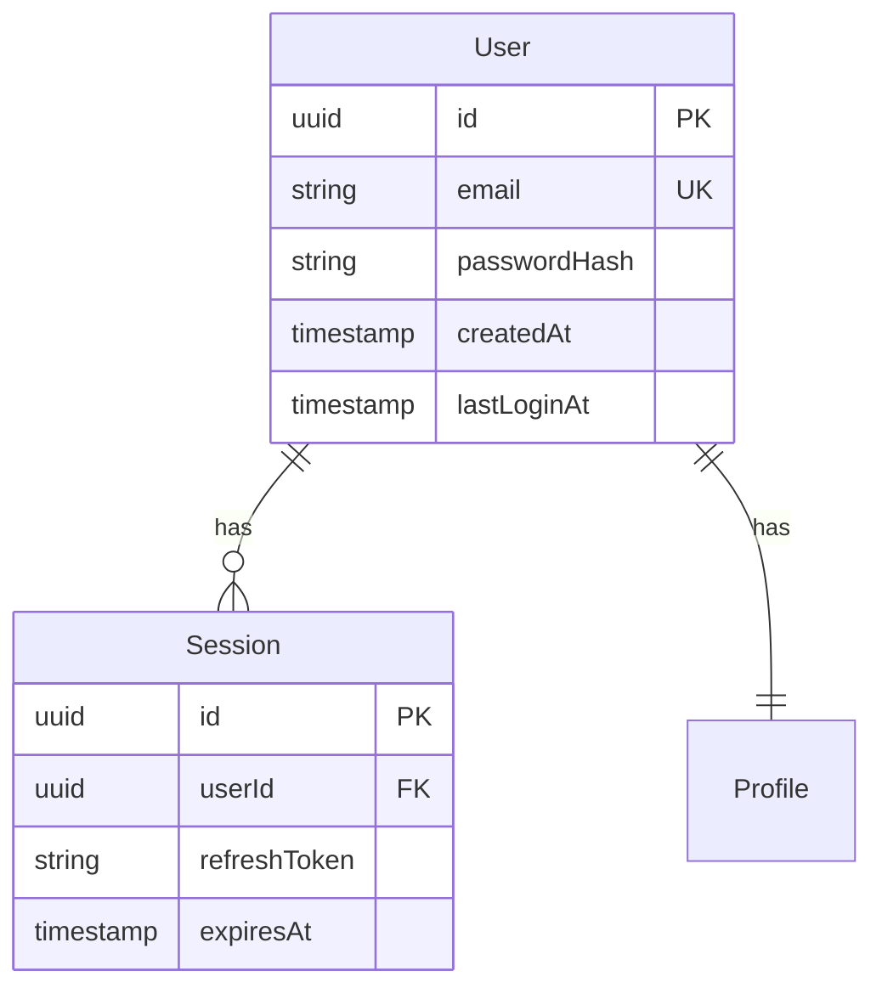

# Major 워크플로우 - 문서 템플릿

## 생성되는 문서 목록

Major 워크플로우는 다음 문서를 `.specify/features/NNN-feature-name/` 경로에 생성합니다:

1. **spec.md** - 요구사항 명세서 (필수)
2. **plan.md** - 구현 계획 (필수, 재사용성 분석 포함)
3. **tasks.md** - 작업 목록 (필수)
4. **research.md** - 연구 결과 (선택)
5. **data-model.md** - 데이터 모델 (필요시)

## 1. spec.md - 요구사항 명세서

### 템플릿 구조

```markdown
# Spec: [기능명]

## Metadata
- Feature ID: [ID]
- Complexity: [점수]/15 (Major)
- Estimated: [예상 소요 시간]
- Created: [날짜]
- Branch: [브랜치명]

## Overview
[기능에 대한 간략한 설명]

## User Scenarios
### [US1] [시나리오 제목]
**Actor**: [사용자 유형]

**Preconditions**:
- [사전 조건 1]
- [사전 조건 2]

**Steps**:
1. [단계 1]
2. [단계 2]
3. [단계 3]

**Expected Result**:
- [예상 결과]

**Test Cases**:
- TC1: [테스트 케이스 1]
- TC2: [테스트 케이스 2]

## Functional Requirements
### FR1: [요구사항 제목]
**Description**: [상세 설명]
**Priority**: High/Medium/Low
**Dependencies**: [의존성]

## Key Entities
### Entity: [엔티티명]
**Attributes**:
- [속성1]: [타입] - [설명]
- [속성2]: [타입] - [설명]

**Relationships**:
- [관계 설명]

## Success Criteria
- [ ] [기준 1]
- [ ] [기준 2]
- [ ] 80%+ 테스트 커버리지
- [ ] [성능 기준]

## Assumptions & Constraints
**Assumptions**:
- [가정 1]
- [가정 2]

**Constraints**:
- [제약사항 1]
- [제약사항 2]

## Open Questions
1. [질문 1]
2. [질문 2]
```

### 실제 예시

```markdown
# Spec: User Authentication System

## Metadata
- Feature ID: AUTH-001
- Complexity: 12/15 (Major)
- Estimated: 3-5 days
- Created: 2025-11-18
- Branch: 010-auth-system
- Location: .specify/features/010-auth-system/

## Overview
JWT 기반 사용자 인증 시스템 구현. 로그인, 회원가입, 비밀번호 재설정 기능 포함.

## User Scenarios
### [US1] 이메일로 로그인
**Actor**: 등록된 사용자

**Preconditions**:
- 사용자 계정이 존재함
- 이메일 인증 완료

**Steps**:
1. 사용자가 이메일/비밀번호 입력
2. 시스템이 credentials 검증
3. JWT 토큰 발급
4. 대시보드로 리다이렉트

**Expected Result**:
- 성공 시: JWT 토큰 발급 및 로그인 상태 유지
- 실패 시: 에러 메시지 표시

**Test Cases**:
- TC1: 올바른 credentials로 로그인 성공
- TC2: 잘못된 비밀번호로 로그인 실패
- TC3: 존재하지 않는 이메일로 로그인 실패

## Functional Requirements
### FR1: JWT 토큰 관리
**Description**: 안전한 JWT 토큰 생성 및 검증
**Priority**: High
**Dependencies**: bcrypt, jsonwebtoken

### FR2: 비밀번호 암호화
**Description**: bcrypt를 사용한 비밀번호 해싱
**Priority**: High
**Dependencies**: bcrypt

## Key Entities
### Entity: User
**Attributes**:
- id: UUID - 고유 식별자
- email: string - 이메일 주소 (unique)
- passwordHash: string - 암호화된 비밀번호
- createdAt: datetime - 생성 시간

**Relationships**:
- User has many Sessions

## Success Criteria
- [ ] 로그인 < 500ms
- [ ] JWT 유효 기간: 24시간
- [ ] Refresh token 지원
- [ ] 80%+ 테스트 커버리지
- [ ] OWASP Top 10 보안 준수

## Assumptions & Constraints
**Assumptions**:
- 사용자는 유효한 이메일 주소를 가짐
- HTTPS 환경에서 운영

**Constraints**:
- 비밀번호 최소 8자 이상
- JWT는 httpOnly 쿠키에 저장
- 동시 로그인 최대 5세션

## Open Questions
1. 소셜 로그인 지원 여부? → Phase 2로 연기
2. 2FA 필요성? → 선택 사항으로 남김
```

## 2. plan.md - 구현 계획

### 템플릿 구조

```markdown
# Implementation Plan: [기능명]

## Reusability Analysis
### 재사용 가능 컴포넌트
**발견된 패턴**:
- [파일 경로]: [설명]
- [파일 경로]: [설명]

**재사용 권장사항**:
1. [권장사항 1]
2. [권장사항 2]

**새로 작성이 필요한 부분**:
- [부분 1]: [이유]
- [부분 2]: [이유]

## Constitution Check
### 아키텍처 준수 사항
**적용 아키텍처**: [Custom FSD/Clean/Hexagonal 등]

**준수 사항**:
- ✓ [규칙 1]
- ✓ [규칙 2]

**주의 사항**:
- ⚠️ [주의할 점 1]
- ⚠️ [주의할 점 2]

## Technical Foundation
### 기술 스택
**Core**:
- [기술 1]: [버전] - [용도]
- [기술 2]: [버전] - [용도]

**Dependencies**:
```json
{
  "dependencies": {
    "[패키지명]": "[버전]"
  },
  "devDependencies": {
    "[패키지명]": "[버전]"
  }
}
```

## Source Code Structure
### 디렉토리 구조
```
[아키텍처별 구조]
```

### 파일별 역할
- **[파일명]**: [역할 설명]
- **[파일명]**: [역할 설명]

## Implementation Phases
### Phase 1: [단계명] ([예상 시간])
**목표**: [목표 설명]

**Tasks**:
1. [작업 1]
2. [작업 2]

**Deliverables**:
- [결과물 1]
- [결과물 2]

### Phase 2: [단계명] ([예상 시간])
[동일한 형식 반복]

## Testing Strategy
### Unit Tests
- [테스트 대상 1]
- [테스트 대상 2]

### Integration Tests
- [시나리오 1]
- [시나리오 2]

### E2E Tests
- [사용자 플로우 1]
- [사용자 플로우 2]

## Estimated Timeline
| Phase | Duration | Dependencies |
|-------|----------|--------------|
| Phase 1 | [시간] | - |
| Phase 2 | [시간] | Phase 1 |
| Testing | [시간] | All phases |

**Total**: [총 시간]
```

### 실제 예시 (Custom FSD)

```markdown
# Implementation Plan: Auth System

## Reusability Analysis
### 재사용 가능 컴포넌트
**발견된 패턴**:
- src/shared/lib/api/apiClient.ts: HTTP 클라이언트
- src/shared/lib/storage/tokenStorage.ts: 토큰 저장소
- src/shared/lib/validation/formValidation.ts: 폼 검증 유틸
- src/features/user/ui/UserForm.tsx: 폼 패턴 참고

**재사용 권장사항**:
1. apiClient 재사용 - 새로운 API 클라이언트 만들지 말 것
2. tokenStorage 확장 - JWT 저장 로직 추가
3. formValidation 패턴 따르기 - Zod 스키마 사용

**새로 작성이 필요한 부분**:
- features/auth/: 인증 도메인 전체 (신규)
- JWT 검증 미들웨어 (기존에 없음)

## Constitution Check
### 아키텍처 준수 사항
**적용 아키텍처**: Custom FSD (Domain-centric)

**준수 사항**:
- ✓ features/auth/ 도메인 단위로 구성
- ✓ Widgets 레이어 제거 (pages로 통합)
- ✓ index.ts를 통한 Public API
- ✓ Type-only imports만 features 간 허용

**주의 사항**:
- ⚠️ features/user/에서 직접 import 금지 (type만 허용)
- ⚠️ 도메인 내 검증 로직 공유 가능 (orderValidation.ts 패턴)

## Technical Foundation
### 기술 스택
**Core**:
- bcrypt: ^5.1.0 - 비밀번호 해싱
- jsonwebtoken: ^9.0.0 - JWT 생성/검증
- zod: ^3.22.0 - 스키마 검증

**Dependencies**:
```json
{
  "dependencies": {
    "bcrypt": "^5.1.0",
    "jsonwebtoken": "^9.0.0",
    "zod": "^3.22.0"
  },
  "devDependencies": {
    "@types/bcrypt": "^5.0.0",
    "@types/jsonwebtoken": "^9.0.0"
  }
}
```

## Source Code Structure
### 디렉토리 구조 (Custom FSD)
```typescript
features/auth/              // ✅ Domain-centric
├── api/
│   ├── signIn.ts           // 관련 액션들을 하나의 도메인에
│   ├── signUp.ts
│   ├── signOut.ts
│   ├── refreshToken.ts
│   └── resetPassword.ts
├── model/
│   ├── types.ts            // 모든 auth 관련 타입
│   ├── useAuth.ts          // Auth hook
│   ├── authValidation.ts   // ✅ 도메인 내 검증 공유
│   └── authSchemas.ts      // Zod schemas
├── lib/
│   ├── jwtUtils.ts         // JWT 유틸리티
│   └── passwordUtils.ts    // 비밀번호 유틸
├── ui/
│   ├── SignInForm.tsx
│   ├── SignUpForm.tsx
│   └── PasswordResetForm.tsx
└── index.ts                // Public API
```

### 파일별 역할
- **api/signIn.ts**: 로그인 API 호출
- **model/useAuth.ts**: 인증 상태 관리 hook
- **model/authValidation.ts**: 도메인 내 공유 검증 로직
- **lib/jwtUtils.ts**: JWT 생성/검증 유틸
- **ui/SignInForm.tsx**: 로그인 폼 컴포넌트

## Implementation Phases
### Phase 1: Setup & Foundation (1 day)
**목표**: 프로젝트 구조 및 의존성 설정

**Tasks**:
1. 의존성 설치 (bcrypt, jsonwebtoken, zod)
2. features/auth/ 디렉토리 생성
3. TypeScript 타입 정의
4. API 라우트 설정

**Deliverables**:
- 완성된 디렉토리 구조
- 타입 정의 완료
- API 엔드포인트 준비

### Phase 2: Core Logic (2 days)
**목표**: 핵심 인증 로직 구현

**Tasks**:
1. 로그인/회원가입 API 구현
2. JWT 생성/검증 로직
3. 비밀번호 해싱
4. Refresh token 로직

**Deliverables**:
- 작동하는 인증 API
- JWT 토큰 시스템
- 토큰 저장소 통합

### Phase 3: UI Components (1 day)
**목표**: 사용자 인터페이스 구현

**Tasks**:
1. SignInForm, SignUpForm 구현
2. Form validation (Zod)
3. 에러 처리 UI
4. 로딩 상태 관리

**Deliverables**:
- 완성된 폼 컴포넌트
- 에러 메시지 표시
- UX 개선

### Phase 4: Testing & Polish (1 day)
**목표**: 테스트 및 품질 개선

**Tasks**:
1. Unit tests (80%+)
2. Integration tests
3. E2E tests (핵심 플로우)
4. 문서화

**Deliverables**:
- 80%+ 테스트 커버리지
- 통과하는 모든 테스트
- API 문서

## Testing Strategy
### Unit Tests
- authValidation.ts (검증 로직)
- jwtUtils.ts (JWT 유틸)
- passwordUtils.ts (비밀번호 유틸)
- API 함수들

### Integration Tests
- 로그인 플로우 (API → UI)
- 회원가입 플로우
- 토큰 갱신 플로우

### E2E Tests
- 로그인 → 대시보드 이동
- 회원가입 → 이메일 인증 → 로그인
- 비밀번호 재설정

## Estimated Timeline
| Phase | Duration | Dependencies |
|-------|----------|--------------|
| Phase 1 | 1 day | - |
| Phase 2 | 2 days | Phase 1 |
| Phase 3 | 1 day | Phase 2 |
| Phase 4 | 1 day | Phase 1-3 |

**Total**: 5 days
```

## 3. tasks.md - 작업 목록

### 템플릿 구조

```markdown
# Tasks: [기능명] Implementation

## Progress Tracking
- Total Tasks: [총 개수]
- Completed: [완료]/[총 개수] ([퍼센트]%)
- Estimated: [예상 시간]

## Phase [숫자]: [단계명]

### Task [번호]: [작업 제목]
**Priority**: High/Medium/Low
**Estimated**: [시간]

**Description**:
[작업 상세 설명]

**Subtasks**:
- [ ] [하위 작업 1]
- [ ] [하위 작업 2]
- [ ] [하위 작업 3]

**Files to modify**:
- [파일 경로] (new/update/delete)
- [파일 경로] (new/update/delete)

**Verification**:
- [ ] [검증 항목 1]
- [ ] [검증 항목 2]
- [ ] [테스트 통과]

**Dependencies**:
- Requires: [의존 작업]
- Blocks: [차단하는 작업]
```

### 실제 예시

```markdown
# Tasks: Auth System Implementation

## Progress Tracking
- Total Tasks: 12
- Completed: 0/12 (0%)
- Estimated: 5 days
- Location: .specify/features/010-auth-system/

## Phase 1: Setup & Prerequisites

### Task 1.1: Project Setup
**Priority**: High
**Estimated**: 2 hours

**Description**:
프로젝트 의존성 설치 및 기본 구조 생성

**Subtasks**:
- [ ] bcrypt, jsonwebtoken, zod 설치
- [ ] features/auth/ 디렉토리 구조 생성
- [ ] TypeScript 타입 파일 생성
- [ ] API 라우트 설정

**Files to modify**:
- package.json (update)
- features/auth/model/types.ts (new)
- app/api/auth/[...route]/route.ts (new)

**Verification**:
- [ ] 모든 의존성 설치 완료
- [ ] TypeScript 컴파일 에러 없음
- [ ] 디렉토리 구조가 plan.md와 일치

**Dependencies**:
- Requires: -
- Blocks: Task 1.2, 2.1

### Task 1.2: Reusability Integration
**Priority**: High
**Estimated**: 1 hour

**Description**:
기존 패턴 및 컴포넌트 재사용 설정

**Subtasks**:
- [ ] shared/lib/api/apiClient 재사용 확인
- [ ] shared/lib/storage/tokenStorage JWT 확장
- [ ] shared/lib/validation 패턴 적용

**Files to modify**:
- shared/lib/storage/tokenStorage.ts (update)
- features/auth/api/signIn.ts (new, uses apiClient)

**Verification**:
- [ ] apiClient 재사용 확인
- [ ] tokenStorage JWT 저장 가능
- [ ] 중복 코드 없음

**Dependencies**:
- Requires: Task 1.1
- Blocks: Task 2.1

[추가 작업 계속...]
```

## 4. research.md - 연구 결과

### 템플릿 구조

```markdown
# Research: [주제]

## Overview
[연구 목적 및 배경]

## Options Considered
### Option 1: [옵션명]
**Pros**:
- [장점 1]
- [장점 2]

**Cons**:
- [단점 1]
- [단점 2]

**Use Cases**:
- [사용 케이스]

### Option 2: [옵션명]
[동일한 형식]

## Benchmarks
### Performance Test
| Library | Load Time | Bundle Size | Score |
|---------|-----------|-------------|-------|
| [옵션1] | [시간] | [크기] | [점수] |
| [옵션2] | [시간] | [크기] | [점수] |

## Decision
**Selected**: [선택한 옵션]

**Rationale**:
- [이유 1]
- [이유 2]

## References
- [참고 자료 1]
- [참고 자료 2]
```

### 실제 예시

```markdown
# Research: JWT Library Comparison

## Overview
인증 시스템을 위한 JWT 라이브러리 선택

## Options Considered
### Option 1: jsonwebtoken
**Pros**:
- 업계 표준
- 광범위한 커뮤니티
- 풍부한 문서
- 20M+ weekly downloads

**Cons**:
- 동기 API (blocking)
- 큰 번들 크기 (47KB)

**Use Cases**:
- 서버 사이드 인증
- Node.js 환경

### Option 2: jose
**Pros**:
- 현대적인 API (Promise 기반)
- 작은 번들 크기 (23KB)
- Edge runtime 지원
- TypeScript 네이티브

**Cons**:
- 상대적으로 새로운 라이브러리
- 적은 커뮤니티

**Use Cases**:
- Edge functions
- 클라이언트 사이드

## Benchmarks
### Performance Test
| Library | Sign Time | Verify Time | Bundle Size |
|---------|-----------|-------------|-------------|
| jsonwebtoken | 0.8ms | 0.5ms | 47KB |
| jose | 1.2ms | 0.7ms | 23KB |

## Decision
**Selected**: jsonwebtoken

**Rationale**:
- 프로젝트에서 이미 사용 중 (재사용성)
- 안정성과 검증된 보안
- 팀의 익숙도
- 번들 크기는 서버 사이드에서 중요하지 않음

## References
- https://github.com/auth0/node-jsonwebtoken
- https://github.com/panva/jose
```

## 5. data-model.md - 데이터 모델

### 템플릿 구조

```markdown
# Data Model: [기능명]

## Entity Definitions

### Entity: [엔티티명]
**Description**: [엔티티 설명]

**Attributes**:
| Field | Type | Constraints | Description |
|-------|------|-------------|-------------|
| [필드] | [타입] | [제약] | [설명] |

**Relationships**:
- [관계 설명]

## ERD
```mermaid
erDiagram
    [엔티티1] ||--o{ [엔티티2] : [관계]
```

## Database Schema

### Prisma Schema
```prisma
model [Model] {
  [필드] [타입] [속성]
}
```

### Indexes
- [인덱스 정의]

## Migrations
### Migration: [날짜]_[제목]
**Changes**:
- [변경사항]

**SQL**:
```sql
[SQL 코드]
```
```

### 실제 예시

```markdown
# Data Model: Authentication System

## Entity Definitions

### Entity: User
**Description**: 시스템 사용자 정보

**Attributes**:
| Field | Type | Constraints | Description |
|-------|------|-------------|-------------|
| id | UUID | PK, NOT NULL | 사용자 고유 ID |
| email | VARCHAR(255) | UNIQUE, NOT NULL | 이메일 주소 |
| passwordHash | VARCHAR(255) | NOT NULL | 암호화된 비밀번호 |
| createdAt | TIMESTAMP | NOT NULL | 계정 생성 시간 |
| updatedAt | TIMESTAMP | NOT NULL | 마지막 업데이트 |
| lastLoginAt | TIMESTAMP | NULL | 마지막 로그인 시간 |

**Relationships**:
- User has many Sessions (1:N)
- User has one Profile (1:1)

### Entity: Session
**Description**: 사용자 세션 정보

**Attributes**:
| Field | Type | Constraints | Description |
|-------|------|-------------|-------------|
| id | UUID | PK, NOT NULL | 세션 ID |
| userId | UUID | FK, NOT NULL | 사용자 ID |
| refreshToken | VARCHAR(255) | NOT NULL | Refresh 토큰 |
| expiresAt | TIMESTAMP | NOT NULL | 만료 시간 |
| createdAt | TIMESTAMP | NOT NULL | 생성 시간 |

**Relationships**:
- Session belongs to User (N:1)

## ERD


## Database Schema

### Prisma Schema
```prisma
model User {
  id           String    @id @default(uuid())
  email        String    @unique
  passwordHash String
  createdAt    DateTime  @default(now())
  updatedAt    DateTime  @updatedAt
  lastLoginAt  DateTime?

  sessions Session[]
  profile  Profile?

  @@index([email])
}

model Session {
  id           String   @id @default(uuid())
  userId       String
  refreshToken String
  expiresAt    DateTime
  createdAt    DateTime @default(now())

  user User @relation(fields: [userId], references: [id], onDelete: Cascade)

  @@index([userId])
  @@index([expiresAt])
}
```

### Indexes
- User.email (unique): 로그인 성능
- Session.userId: 사용자별 세션 조회
- Session.expiresAt: 만료된 세션 정리

## Migrations
### Migration: 20251118_create_auth_tables
**Changes**:
- User 테이블 생성
- Session 테이블 생성
- Indexes 생성

**SQL**:
```sql
CREATE TABLE "User" (
  "id" UUID PRIMARY KEY DEFAULT gen_random_uuid(),
  "email" VARCHAR(255) UNIQUE NOT NULL,
  "passwordHash" VARCHAR(255) NOT NULL,
  "createdAt" TIMESTAMP NOT NULL DEFAULT NOW(),
  "updatedAt" TIMESTAMP NOT NULL DEFAULT NOW(),
  "lastLoginAt" TIMESTAMP
);

CREATE TABLE "Session" (
  "id" UUID PRIMARY KEY DEFAULT gen_random_uuid(),
  "userId" UUID NOT NULL,
  "refreshToken" VARCHAR(255) NOT NULL,
  "expiresAt" TIMESTAMP NOT NULL,
  "createdAt" TIMESTAMP NOT NULL DEFAULT NOW(),
  FOREIGN KEY ("userId") REFERENCES "User"("id") ON DELETE CASCADE
);

CREATE INDEX "User_email_idx" ON "User"("email");
CREATE INDEX "Session_userId_idx" ON "Session"("userId");
CREATE INDEX "Session_expiresAt_idx" ON "Session"("expiresAt");
```
```

---

**참고**:
- [major-examples.md](major-examples.md) - 사용 예시
- [major-troubleshooting.md](major-troubleshooting.md) - 문제 해결
- [major.md](../major.md) - 메인 문서
