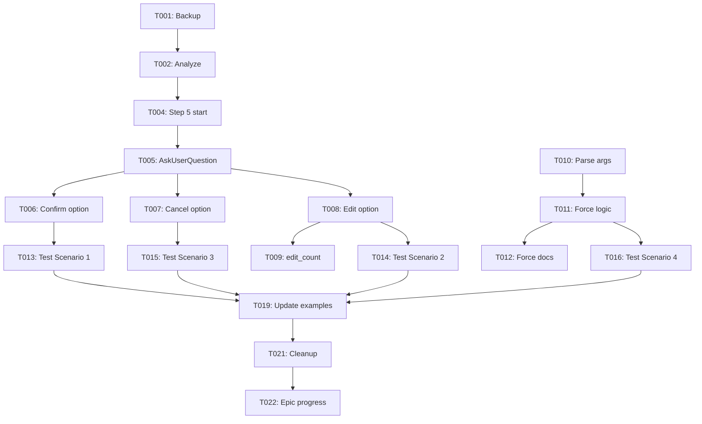

# Tasks: Commit Workflow Enhancement

## Task Format
Format: [T001] [P?] [Story?] Description /absolute/path/to/file
  - [P]: Parallelizable
  - [Story]: User Story ID (e.g., US1)

## Phase 1: Setup & Prerequisites

- [x] [T001] [P] commit.md 백업 생성 /Users/hk/Documents/claude-workflow/.claude/commands/commit.md.backup
```bash
cd /Users/hk/Documents/claude-workflow
cp .claude/commands/commit.md .claude/commands/commit.md.backup
echo "✅ Backup created"
```

- [x] [T002] [P] 현재 Step 5 코드 분석 /Users/hk/Documents/claude-workflow/.claude/commands/commit.md
```bash
# Read 도구로 commit.md의 Step 5 섹션 읽기
# 라인 82-98 확인 (Step 5: 커밋 메시지 확인 및 수정)
```

- [x] [T003] [P] AskUserQuestion 사용 예시 조사
```bash
# Grep 도구로 프로젝트 내 AskUserQuestion 사용 패턴 검색
grep -r "AskUserQuestion" .claude/commands/
```

## Phase 2: Step 5 리팩토링

### User Story - [US1] 커밋 메시지 확인 및 실행

**Goal**: 텍스트 기반 설명을 AskUserQuestion 도구 호출로 교체
**Test Verification**: Quickstart Scenario 1 통과

- [x] [T004] [US1] Step 5 섹션 시작 부분 수정 /Users/hk/Documents/claude-workflow/.claude/commands/commit.md
```markdown
변경 전:
### Step 5: 커밋 메시지 확인 및 수정

```markdown
📝 생성된 커밋 메시지:

feat(order): 운송 신청 폼에 차량 선택 기능 추가
...
```

변경 후:
### Step 5: 커밋 메시지 확인 및 수정

📝 생성된 커밋 메시지를 표시한 후, **AskUserQuestion 도구를 사용**하여 사용자 확인을 받습니다.
```

- [x] [T005] [US1] AskUserQuestion 도구 호출 코드 추가 /Users/hk/Documents/claude-workflow/.claude/commands/commit.md
```markdown
**AskUserQuestion 호출**:

다음과 같이 AskUserQuestion 도구를 호출하세요:

```
AskUserQuestion({
  questions: [{
    question: "다음 커밋 메시지로 커밋하시겠습니까?\n\n" + generated_message,
    header: "커밋 확인",
    multiSelect: false,
    options: [
      {
        label: "커밋 실행",
        description: "이 메시지로 커밋합니다"
      },
      {
        label: "메시지 수정",
        description: "커밋 메시지를 수정합니다"
      },
      {
        label: "취소",
        description: "커밋하지 않습니다"
      }
    ]
  }]
})
```
```

- [x] [T006] [US1] "커밋 실행" 옵션 처리 로직 추가 /Users/hk/Documents/claude-workflow/.claude/commands/commit.md
```markdown
**각 옵션 처리**:

#### Option 1: "커밋 실행" 선택
사용자가 "커밋 실행"을 선택한 경우:
1. generated_message를 final_message로 설정
2. Step 6 (Git Commit 실행)으로 이동
```

- [x] [T007] [US1] "취소" 옵션 처리 로직 추가 /Users/hk/Documents/claude-workflow/.claude/commands/commit.md
```markdown
#### Option 3: "취소" 선택
사용자가 "취소"를 선택한 경우:
1. 다음 메시지 출력:
   ```
   ❌ 커밋이 취소되었습니다.

   Staged 파일은 그대로 유지됩니다.
   다시 커밋하려면 /commit을 실행하세요.
   ```
2. 워크플로우 종료 (Step 6으로 이동하지 않음)
```

## Phase 3: Edit 처리 구현

### User Story - [US2] 메시지 수정

**Goal**: "메시지 수정" 선택 시 재귀적 확인 프로세스 구현
**Test Verification**: Quickstart Scenario 2 통과

- [x] [T008] [US2] "메시지 수정" 옵션 처리 로직 추가 /Users/hk/Documents/claude-workflow/.claude/commands/commit.md
```markdown
#### Option 2: "메시지 수정" 선택
사용자가 "메시지 수정"을 선택한 경우:

1. edit_count 변수 증가 (최초 0에서 시작)
2. edit_count > 3인지 확인:
   - Yes → 에러 메시지 출력 후 종료:
     ```
     ❌ 최대 메시지 수정 횟수(3회)를 초과했습니다.

     처음부터 다시 시작하려면 /commit을 다시 실행하세요.
     ```
   - No → 다음 단계 진행

3. AskUserQuestion으로 수정된 메시지 입력 받기:
   ```
   AskUserQuestion({
     questions: [{
       question: "수정할 커밋 메시지를 입력하세요:\n\n기존 메시지:\n" + generated_message,
       header: "메시지 수정",
       multiSelect: false,
       options: [
         {
           label: "직접 입력하겠습니다",
           description: "Other 옵션으로 새 메시지 입력"
         }
       ]
     }]
   })
   ```

4. 사용자가 입력한 메시지를 new_message로 저장
5. generated_message = new_message로 업데이트
6. **Step 5로 다시 돌아가기** (재귀적 확인)
```

- [x] [T009] [US2] edit_count 변수 초기화 코드 추가 /Users/hk/Documents/claude-workflow/.claude/commands/commit.md
```markdown
**Step 5 진입 전 초기화**:

Step 5에 처음 진입할 때 다음 변수를 초기화하세요:
```javascript
let edit_count = 0;  // 메시지 수정 횟수 추적
```
```

## Phase 4: --force 옵션 구현

- [x] [T010] 명령어 인자 파싱 로직 추가 /Users/hk/Documents/claude-workflow/.claude/commands/commit.md
```markdown
**Step 0: 명령어 인자 파싱** (새 섹션 추가)

/commit 명령어의 인자를 파싱합니다:

```javascript
// 사용자 입력: /commit --force
const args = parseCommandArgs();
const has_force_flag = args.includes('--force');
```

파싱 결과:
- has_force_flag = true → Step 5 건너뛰기
- has_force_flag = false → 정상 프로세스 진행
```

- [x] [T011] --force 플래그 처리 로직 추가 /Users/hk/Documents/claude-workflow/.claude/commands/commit.md
```markdown
**Step 4와 Step 5 사이에 분기 추가**:

Step 4 (커밋 메시지 생성) 완료 후:

```javascript
if (has_force_flag) {
  // Step 5 건너뛰기
  console.log("⚡ --force 옵션으로 확인 없이 커밋 실행");
  // 바로 Step 6으로 이동
} else {
  // Step 5 (확인 단계) 실행
}
```
```

- [x] [T012] --force 옵션 문서화 /Users/hk/Documents/claude-workflow/.claude/commands/commit.md
```markdown
**사용법 섹션 업데이트**:

```bash
/commit              # 변경사항 분석 후 확인 단계를 거쳐 커밋 (기본)
/commit --force      # 확인 없이 바로 커밋 (긴급 상황용)
/commit --no-verify  # 검증 없이 빠른 커밋
/commit "컨텍스트"   # 추가 컨텍스트와 함께 커밋
```

**--force 옵션**:
- 확인 단계(Step 5)를 건너뜁니다
- 긴급 상황이나 CI/CD에서 유용합니다
- 주의: 실수 가능성이 있으므로 신중히 사용하세요
```

## Phase 5: Testing & Verification

- [x] [T013] Scenario 1 테스트: 커밋 메시지 확인 및 실행
```bash
# Quickstart.md의 Scenario 1 실행
echo "test content" > test-commit-enhancement.txt
git add test-commit-enhancement.txt
/commit
# "커밋 실행" 선택
# 검증: 커밋이 정상적으로 완료됨
git log -1
```

- [x] [T014] [US2] Scenario 2 테스트: 메시지 수정
```bash
# Quickstart.md의 Scenario 2 실행
echo "test content 2" > test-commit-edit.txt
git add test-commit-edit.txt
/commit
# "메시지 수정" 선택
# 새 메시지 입력
# "커밋 실행" 선택
# 검증: 수정된 메시지로 커밋됨
git log -1
```

- [x] [T015] Scenario 3 테스트: 커밋 취소
```bash
# Quickstart.md의 Scenario 3 실행
echo "test content 3" > test-commit-cancel.txt
git add test-commit-cancel.txt
/commit
# "취소" 선택
# 검증: 커밋되지 않고 staged 상태 유지
git status
git log -1  # 새 커밋 없음
```

- [x] [T016] Scenario 4 테스트: --force 옵션
```bash
# Quickstart.md의 Scenario 4 실행
echo "test content 4" > test-commit-force.txt
git add test-commit-force.txt
/commit --force
# 검증: AskUserQuestion 없이 바로 커밋됨
git log -1
```

- [x] [T017] Edge Case 테스트: 최대 수정 횟수 초과
```bash
/commit
# "메시지 수정" 선택 → 1회
# "메시지 수정" 선택 → 2회
# "메시지 수정" 선택 → 3회
# "메시지 수정" 선택 → 4회 (에러 발생 예상)
# 검증: "최대 메시지 수정 횟수 초과" 에러 메시지 표시
```

- [x] [T018] Edge Case 테스트: 변경사항 없음
```bash
git status  # clean
/commit
# 검증: "커밋할 변경사항이 없습니다" 메시지 표시
```

## Phase 6: Documentation & Cleanup

- [x] [T019] [P] commit.md 사용 예시 업데이트
```markdown
**예시 섹션에 새 프로세스 반영**:

### 예시 1: 새 기능 추가 (확인 단계 포함)
```bash
/commit

🔍 변경사항 분석 중...

📝 생성된 커밋 메시지:
feat(vehicle): 차량 선택 컴포넌트 구현

┌─────────────────────────────────────┐
│ 커밋 확인                            │
│                                     │
│ [커밋 실행] 이 메시지로 커밋        │
│ [메시지 수정] 커밋 메시지 수정      │
│ [취소] 커밋하지 않음                │
└─────────────────────────────────────┘

"커밋 실행" 선택 →

✅ 커밋이 완료되었습니다!
```
```

- [x] [T020] [P] Quickstart 가이드 최종 검증
```bash
# Quickstart.md의 모든 시나리오가 통과하는지 확인
# 필요시 문서 업데이트
```

- [x] [T021] 테스트 파일 정리
```bash
git rm test-commit-*.txt
git commit -m "test: remove commit enhancement test files"
```

- [x] [T022] Epic progress 업데이트
```bash
# .specify/specs/005-epic-workflow-system-improvement/progress.md 업데이트
# Feature 003 상태를 "completed"로 변경
bash .specify/scripts/bash/update-epic-progress.sh .specify/specs/005-epic-workflow-system-improvement
```

## Progress Tracking

**Total Tasks**: 22
**Completed**: 0
**In Progress**: 0
**Remaining**: 22

**Estimated Time**: 5.5시간 (약 0.7일)

## Task Dependencies



## Notes

**병렬 가능 Tasks**:
- T001, T002, T003 (Setup)
- T019, T020 (Documentation)

**순차 필수 Tasks**:
- T004 → T005 → T006/T007/T008
- T010 → T011 → T012
- T013-T018 (Testing은 구현 완료 후)

**Critical Path**:
T001 → T002 → T004 → T005 → T008 → T014 → T019 → T022

**예상 소요 시간**: 약 5.5시간
